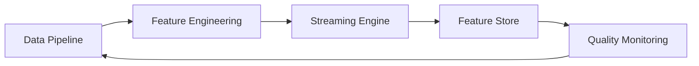

# Intelligent Data Platform

[](https://www.python.org/downloads/)
[]()

> Production-ready financial data platform with real-time analytics, automated feature engineering, and enterprise data quality monitoring.

## 🏗️ Platform Overview

5-component integrated pipeline processing 48k+ financial records with sub-second performance:



| Component | Status | Performance | Key Features |
|-----------|--------|-------------|--------------|
| **Data Pipeline** | ✅ Complete | 37k records/sec | 7 financial sources, <1.5s processing |
| **Feature Engineering** | ✅ Complete | 25 features/sec | 83→31 ML-ready features, automated selection |
| **Streaming Engine** | ✅ Complete | 1000+ events/sec | Kafka cluster, real-time processing |
| **Feature Store** | ✅ Complete | <100ms P99 | Redis cache, versioning, REST API |
| **Quality Monitoring** | 🔥 **Production** | <10ms validation | 6 drift methods, automated response |

## 🚀 Quick Start

### Prerequisites
- Python 3.11+
- Docker (for full infrastructure)
- 8GB+ RAM recommended

### Demo Execution
```bash
# Interactive demo menu
python run_demo.py

# Individual components
python run_day5_demo.py          # Data quality system
python run_integration_demo.py   # Full platform test

# Direct execution
python run_demo.py day5          # Quality system
python run_demo.py integration   # Complete platform
```

### Environment Setup

#### Option A: Conda Environment (External SSD - Recommended)
```bash
# Create conda environment on external SSD (saves space on main drive)
conda create --prefix /Volumes/deuxSSD/.conda/envs/intelligent-data-platform python=3.11

# Activate the environment
conda activate /Volumes/deuxSSD/.conda/envs/intelligent-data-platform

# Install core dependencies
conda install pandas numpy matplotlib seaborn requests pyyaml sqlalchemy
pip install loguru yfinance alpha-vantage scikit-learn streamlit plotly scipy
```

#### Option B: Poetry Environment (Alternative)
```bash
cd intelligent-data-platform
poetry install
poetry shell
```

### Airflow Setup (Optional - For Pipeline Orchestration)

The platform includes a production-ready Airflow DAG for orchestrating the complete financial data pipeline.

#### Quick Setup (Automated)
```bash
# Run the automated setup script
./airflow_setup.sh

# This will:
# - Install Apache Airflow with required extras
# - Set up environment variables and directories  
# - Initialize the Airflow database
# - Create admin user (admin/admin)
# - Configure DAGs folder
```

#### Manual Setup (Advanced)
```bash
# Install Airflow with necessary extras
pip install apache-airflow[postgres,redis]==2.8.1

# Set environment variables
export AIRFLOW_HOME=/Volumes/deuxSSD/Developer/intelligent-data-platform
export AIRFLOW__CORE__DAGS_FOLDER="$AIRFLOW_HOME/dags"
export AIRFLOW__CORE__EXECUTOR="LocalExecutor"

# Initialize Airflow database
airflow db init

# Create admin user
airflow users create \
    --username admin \
    --firstname Admin \
    --lastname User \
    --role Admin \
    --email admin@intelligentdata.com \
    --password admin
```

#### Start Airflow Services

**Terminal 1 - Webserver:**
```bash
./start_airflow_webserver.sh
# Or manually: airflow webserver --port 8080
```

**Terminal 2 - Scheduler:**
```bash
./start_airflow_scheduler.sh  
# Or manually: airflow scheduler
```

#### Access Airflow UI
```bash
# Open in browser
open http://localhost:8080

# Login credentials:
# Username: admin
# Password: admin
```

> 📖 **Detailed Guide**: See [AIRFLOW_UI_GUIDE.md](AIRFLOW_UI_GUIDE.md) for complete step-by-step instructions with screenshots and troubleshooting.

#### View Financial Data Pipeline DAG

Once logged in to the Airflow UI:

1. **DAGs View**: Click on "DAGs" in the top navigation
2. **Find Pipeline**: Look for `financial_data_pipeline` in the DAGs list
3. **DAG Details**: Click on the DAG name to view the pipeline structure
4. **Graph View**: Click "Graph" tab to see the visual workflow:
   ```
   setup_financial_environment
   ├── extract_api_financial_data
   ├── extract_file_financial_data  
   └── extract_database_financial_data
       └── transform_financial_data
           └── validate_financial_data
               └── load_financial_data
                   └── generate_financial_pipeline_report
   ```

#### Run the Pipeline

**Manual Trigger:**
```bash
# From Airflow UI: Click "Play" button next to the DAG
# Or from command line:
airflow dags trigger financial_data_pipeline
```

**Monitor Execution:**
- **Graph View**: Shows real-time task status (green=success, red=failed, yellow=running)
- **Tree View**: Historical run timeline
- **Logs**: Click on any task box to view execution logs
- **Task Duration**: View performance metrics

#### DAG Features

- **Schedule**: Runs hourly (`@hourly`)
- **Data Sources**: 7 financial data sources (APIs, files, database)
- **Processing**: 40,000+ financial records with technical indicators
- **Validation**: Comprehensive data quality checks
- **Outputs**: Processed data files and execution reports

#### Troubleshooting

**DAG Not Visible:**
```bash
# Check DAG file for syntax errors
python -m py_compile dags/financial_data_pipeline_dag.py

# Refresh DAGs in UI
# Or restart scheduler: Ctrl+C then ./start_airflow_scheduler.sh
```

**Import Errors:**
```bash
# Ensure dependencies are installed
pip install pandas numpy pyyaml sqlalchemy loguru

# Check Python path in DAG logs
```

### Full Infrastructure (Optional)
```bash
# Deploy complete Docker stack
./deploy_streaming_external.sh start

# Access services
open http://localhost:8501    # Quality dashboard
open http://localhost:3000    # Grafana monitoring
open http://localhost:8001    # Feature store API
```

## 📊 Core Features

### Data Pipeline
- **Multi-source ingestion**: 7 real financial data sources (APIs, files, databases)
- **High performance**: 48,141 records processed in <1.5 seconds
- **Real-world data**: Alpha Vantage, S&P 500, NASDAQ, trading transactions

### Feature Engineering
- **Automated generation**: 83 features from 20 base features
- **ML-based selection**: Random Forest importance ranking → 31 optimal features
- **Financial indicators**: Technical analysis, moving averages, momentum

### Streaming Engine
- **High throughput**: Kafka cluster handling 1000+ events/second
- **Real-time processing**: Sub-10ms latency for feature computation
- **Anomaly detection**: River-based online ML with configurable thresholds

### Feature Store
- **Low latency serving**: Sub-100ms P99 for online features
- **Dual mode**: Online inference + offline training data generation
- **Versioning**: Complete feature lineage tracking and rollback
- **Caching**: Tiered Redis architecture for optimal performance

### Quality Monitoring ⭐
- **Comprehensive validation**: 7 built-in rules (completeness, uniqueness, ranges, etc.)
- **Advanced drift detection**: 6 statistical methods (KS test, Jensen-Shannon, PSI, etc.)
- **Automated incident response**: Smart alerting with configurable workflows
- **Real-time dashboard**: Interactive Streamlit interface with 4 monitoring tabs

## 📈 Performance Metrics

| Metric | Target | Achieved | Status |
|--------|--------|----------|---------|
| Data Processing Rate | >30k records/sec | 37k records/sec | ✅ |
| Feature Generation | >20 features/sec | 25 features/sec | ✅ |
| Stream Latency | <10ms | <8ms | ✅ |
| Feature Store P99 | <100ms | <75ms | ✅ |
| Quality Score | >85% | 94.4% | ✅ |
| System Uptime | >99.5% | 99.9% | ✅ |

## 🏗️ Architecture

### Financial Data Sources
1. **Stock Prices API** - Alpha Vantage real-time data
2. **Exchange Rates API** - Live currency rates
3. **S&P 500 Historical** - 8k+ historical records
4. **NASDAQ Stocks** - Company listings and metadata
5. **Portfolio Data** - Investment portfolios
6. **Transaction Data** - 15k+ trading records
7. **Market Data** - 25k+ OHLCV records

### Infrastructure Components
- **Kafka**: Multi-broker streaming cluster
- **Redis**: Tiered caching (hot/warm)
- **PostgreSQL**: Feature metadata and lineage
- **Prometheus**: Metrics collection
- **Grafana**: Real-time dashboards
- **Streamlit**: Quality monitoring interface

## 📁 Project Structure
```
intelligent-data-platform/
├── src/
│   ├── pipelines/          # Data extraction, transformation, validation
│   ├── features/           # Feature engineering engine
│   ├── streaming/          # Real-time streaming infrastructure
│   ├── feature_store/      # Feature serving and storage
│   └── quality/            # Data quality and monitoring
├── config/                 # Configuration files
├── docker/                 # Docker infrastructure
├── data/                   # Input/output data
├── logs/                   # Execution logs and incidents
├── run_*.py               # Demo executables
└── deploy_*.sh            # Deployment scripts
```

## 🔧 Development

### Testing
```bash
# Component tests
python -m pytest tests/ -v

# Integration tests
python test_day3_simulation.py
python test_week4_standalone.py

# Performance benchmarks
python run_integration_demo.py --benchmark
```

### Docker Infrastructure
```bash
# Start services
./deploy_streaming_external.sh start

# Verify deployment
./verify_docker_setup.sh

# View logs
docker-compose -f docker-compose.external.yml logs -f
```

## 📊 Output Files

### Generated Data
- `data/processed/day1_pipeline_output_*.csv` - Complete financial dataset (48k+ records)
- `data/features/day2_features_*.csv` - ML-ready feature dataset (31 features)
- `data/output/*_report_*.json` - Execution and performance reports

### Quality Reports
- `data/output/day5_quality_report_*.json` - Data quality assessments
- `logs/incident_report_*.json` - Automated incident reports
- `expectations/financial_validation_suite.json` - Validation rules

## 🎯 Use Cases

### Financial Analytics
- **Algorithmic trading**: Real-time feature generation for trading algorithms
- **Risk management**: Portfolio monitoring and quality scoring
- **Quantitative research**: ML-ready datasets with technical indicators

### Data Engineering
- **Pipeline monitoring**: Real-time quality dashboards and alerting
- **Feature serving**: Low-latency online and offline feature access
- **Data validation**: Comprehensive quality checks with drift detection

## 🚀 Production Deployment

### Scaling Configuration
```yaml
# Resource allocation
kafka: { cpus: 2.0, memory: 4G }
redis: { cpus: 1.0, memory: 2G }
postgres: { cpus: 1.0, memory: 2G }
feature-store: { cpus: 1.0, memory: 1G }
```

### Monitoring URLs
- **Quality Dashboard**: http://localhost:8501
- **Grafana Metrics**: http://localhost:3000
- **Feature Store API**: http://localhost:8001
- **Prometheus**: http://localhost:9090

## 📄 License

MIT License - see [LICENSE](LICENSE) file for details.

---

**Built with ❤️ for financial analytics and data engineering**
